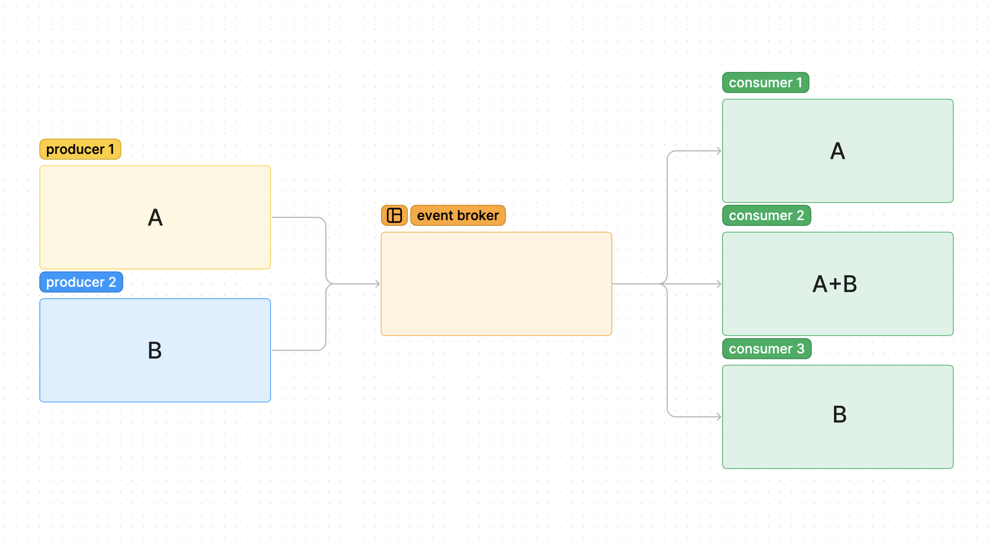

# CAPS

#### Author: Evan Cheng

#### Version: 1.0.0

### Project Overview: Event Driven Application

The goal of this project is to build an event-driven application that simulates a real-world supply chain for a delivery service named CAPS (Code Academy Parcel Service). This system will emulate the operations of a delivery service where vendors send packages using CAPS, and drivers deliver those packages to customers. The system will utilize Node.js for its event-driven architecture, ensuring modular and real-time interactions between different components.  

### UML

